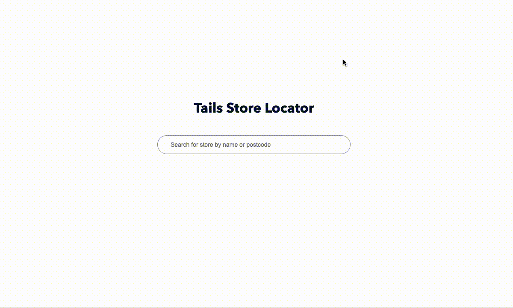

# Tails coding test



## Specification

* Build an API that returns stores from the `stores.json` file, based on a given search string and unit test it. For example, return "Newhaven" when searching for "hav". Make sure the search allows to use both city name and postcode.
* Order the results by matching postcode first and then matching city names. For example, "br" would have "Orpington" as the 1st result as its postcode is "BR5 3RP". Next would be "Bracknell", "Broadstairs", "Tunbridge_Wells", and "Brentford"
* Using your favourite frontend framework (we would prefer Vue) on the user-facing side:
  * Build a frontend that renders a text field for the query and the list of stores that match it
  * Add suggestions to the query field as you type, with a debounce effect of 100ms and a minimum of 2 characters
  * Limit the results to 3 and lazy load the rest on page scroll


## System Requirements

You will need to have docker setup to run this code

## How to run this code

Clone the repository and go into the directory where the package has been placed

### Docker Instructions
Both apps maintain their own docker images.

To run the app
```
  docker-compose up --build
```

Visit port 8080 and you should see the Tails Store Locator page

To test the backend
```
  docker exec -it backend pytest 
```

To test the frontend
```
  docker exec -it frontend npm run test
```
